# ⚡ FlashMob Games

**The Collective Gaming Experience.**

FlashMob Games is a real-time, large-scale multiplayer gaming platform designed for presentations, events, and massive audience engagement. Built with a high-performance **Node.js/Socket.io** backend and a premium **React 19** frontend, it enables hundreds of players to control shared game entities simultaneously via their smartphones.

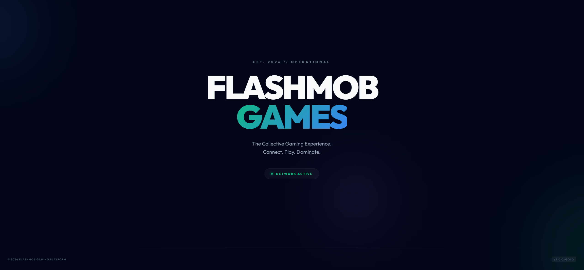

---

---

## 🎮 Supported Games

Manage boredom with high-octane collective action:

### Paddle Battle
High-speed team-based paddle sports.
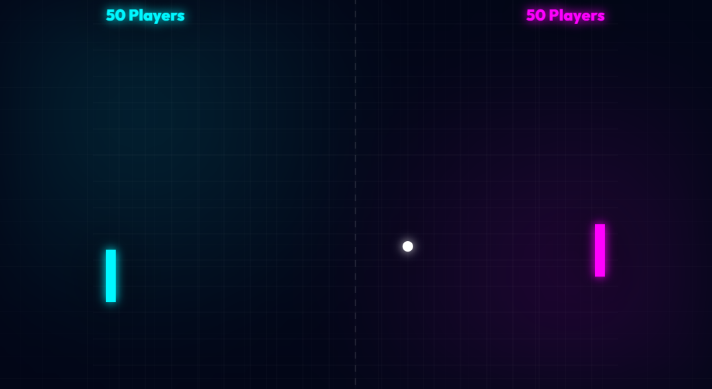

### Brick Burst
Collaborative brick-breaking with additive impulse physics.
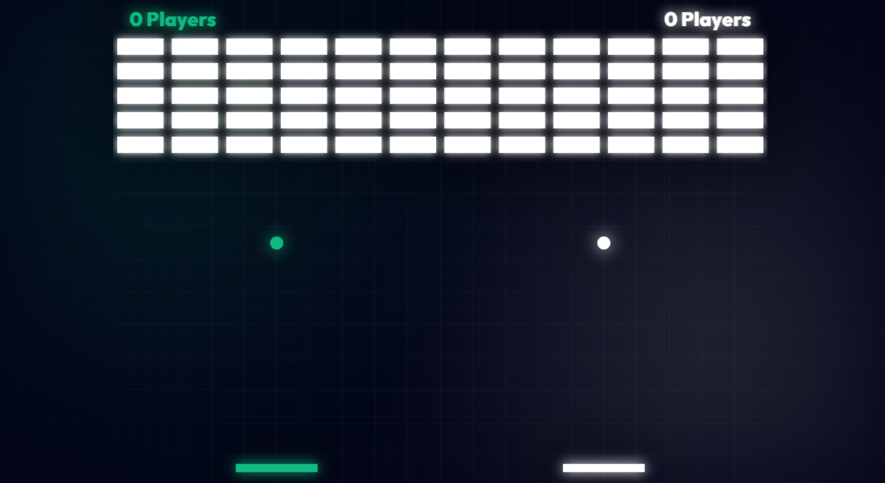

### Vipers
Multi-team survival; lead your collective snake to dominance.
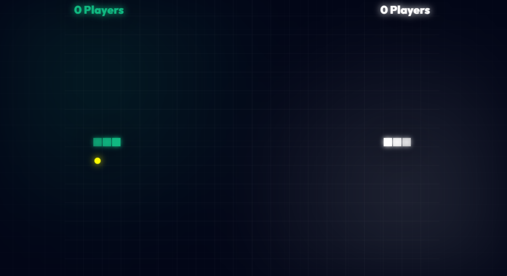

### 📱 Mobile Controller Experience
Players join via their smartphones, which transform into dynamic controllers optimized for each game mode.

| Landing Page | D-Pad Controller | 2-Button Controller |
| :---: | :---: | :---: |
| 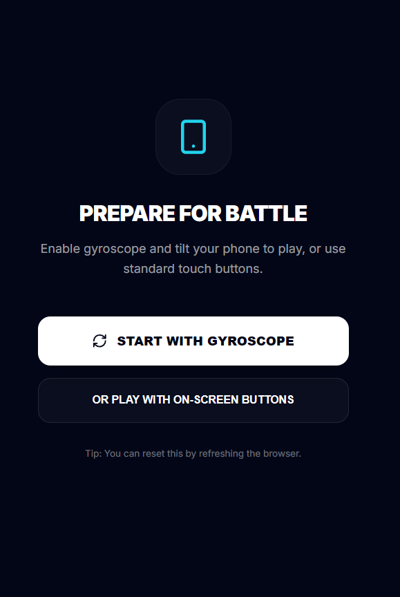 | 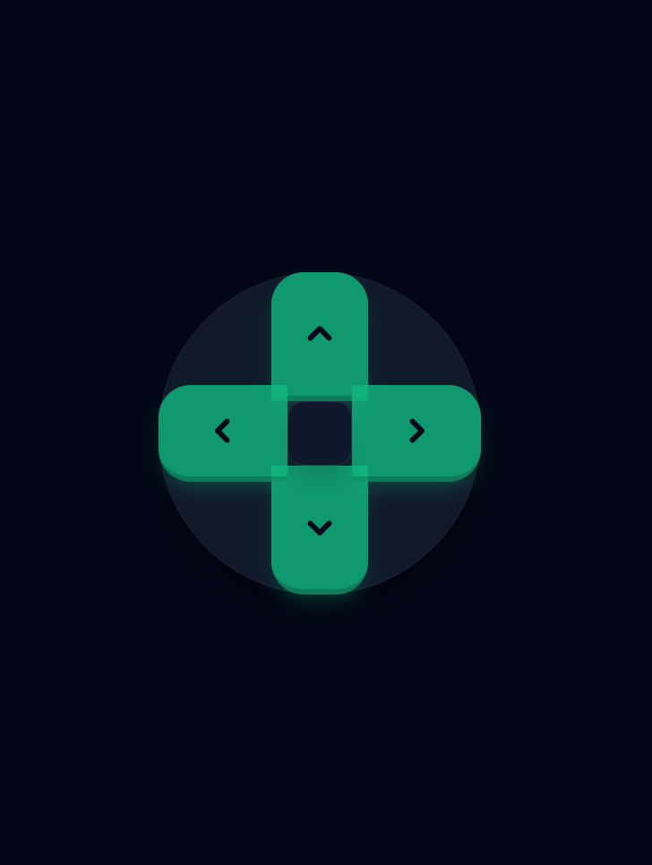 | 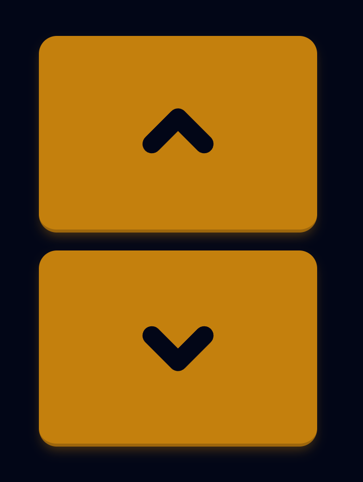 |

---

## 🎬 Cinematic Room Experience

Elevate your event with a **Cinematic Game Room**. Beyond simple gameplay, operators can deploy immersive environments that transform the presentation into a high-production broadcast.

- **Immersive Backgrounds**: Use specialized themes or upload custom event-branded backgrounds.
- **Integrated Telemetry**: Display real-time system performance, player counts, and live transmission stats.
- **Dynamic Overlays**: Positioned QR codes and scoreboards designed for maximum visibility on large-scale projectors.

| Cyberpunk Command | Space Bridge Terminal | Lab Broadcast Setup |
| :---: | :---: | :---: |
| 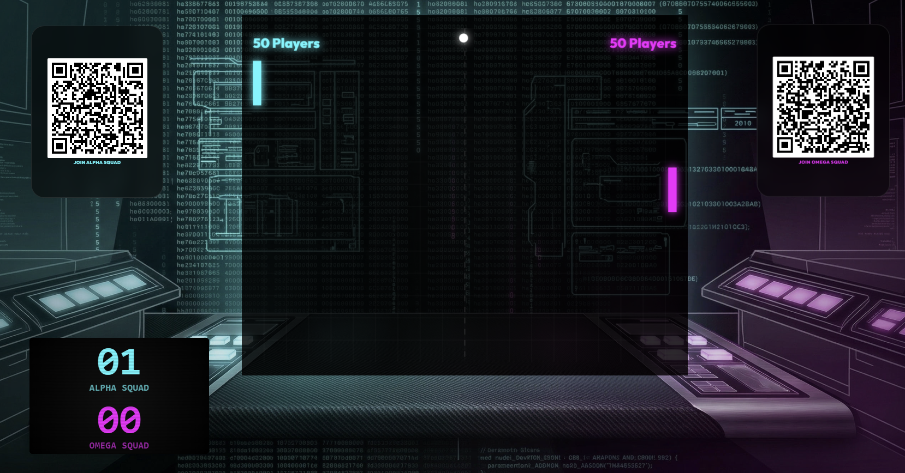 | 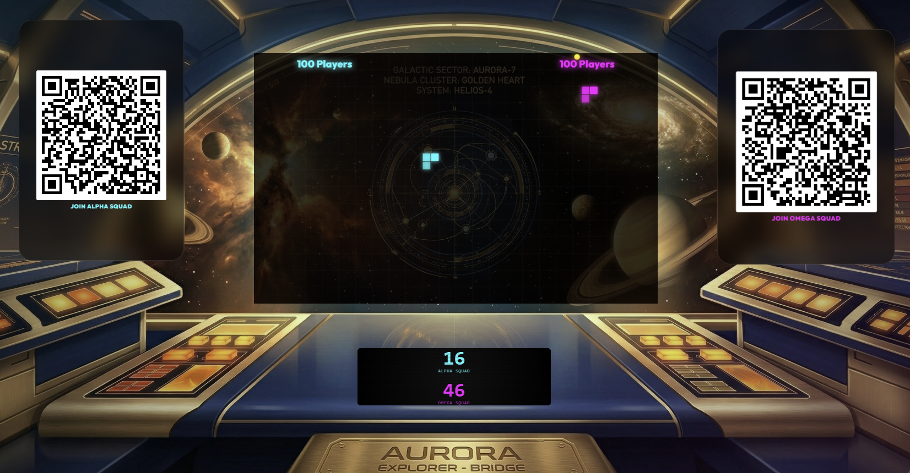 | 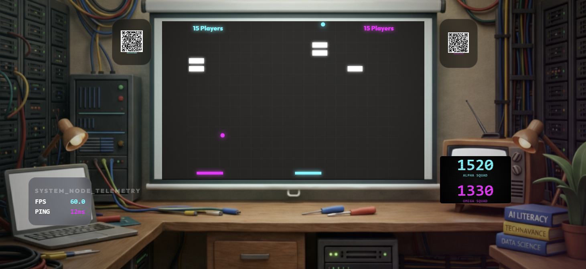 |


---

## 📺 Video Demos

Experience the collective action in real-time:

| Paddle Battle Presenter | Vipers Cinematic Mode | Paddle Battle Cinematic Mode |
| :---: | :---: | :---: |
| [](https://youtu.be/GkCnyL_QnjY) | [](https://youtu.be/w8lJ2S9q6jA) | [](https://youtu.be/IgV0hRbRqQU) |

---

## 🛠️ Technical Stack

Built with state-of-the-art web technologies for maximum performance and stability:

- **Frontend**: 
  - **Framework**: `React 19` + `Vite 8`
  - **Routing**: `React Router Dom 7`
  - **Real-time**: `Socket.io-client 4`
  - **Styling**: Vanilla CSS (Custom Glassmorphism & HSL Design System)
  - **Icons**: `Lucide-React`

- **Backend**: 
  - **Runtime**: `Node.js 25.5`
  - **Server**: `Express 5`
  - **Real-time Engine**: `Socket.io 4 (WebSockets)`
  - **Logging**: `Pino` + `Pino-Pretty`
  - **Validation**: `Zod` (Shared Schemas)
  - **Auth**: `JSON Web Tokens (JWT)`

---

## 🕹️ Operational Management

The platform includes a secured **Management Dashboard** for session operators.

### 1. Accessing the Dashboard
- **URL**: `http://localhost:5173/admin`
- **Authentication**: Credentials are managed via the `.env` file.
    - Default Username: `operator`
    - Default Password: `operator`

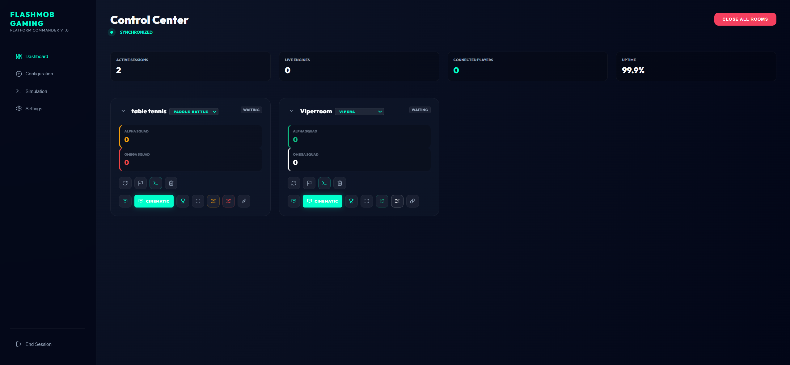

### 2. How to Start a Session
1. **Initialize Room**: Log in to the dashboard and navigate to the **Initialize Room** panel.
2. **Deploy**: Select a game type (e.g., `Brick Burst`), name your room, and click **Deploy Room**.
3. **Control**: Manage the live session from the **Control Room**.
   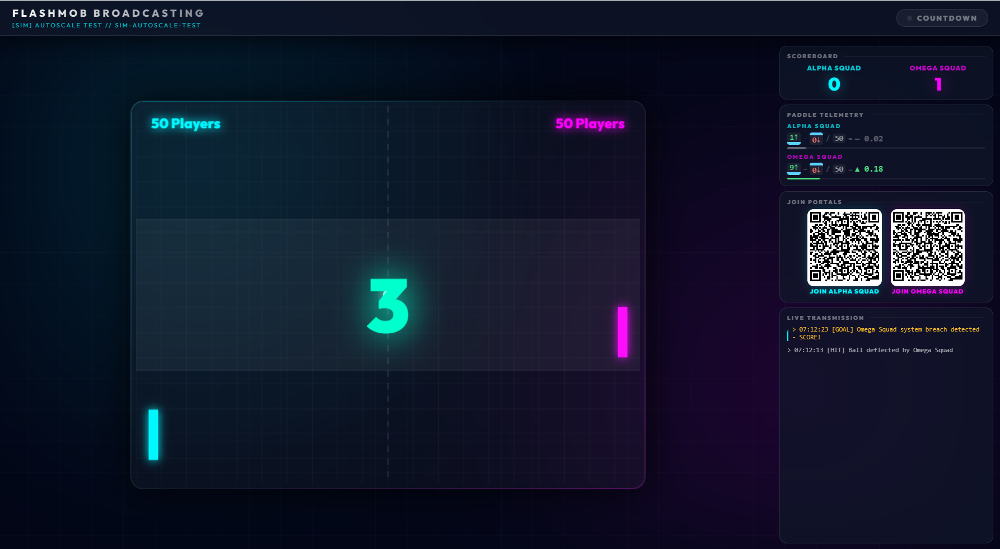
4. **Project**: Select your display mode from the dashboard:
   - Click **Host** for the standard high-performance game view.
   - Click **Cinematic** to launch the immersive broadcast experience with custom branding and telemetry.
5. **Join**: Navigate to the **Join** view or show the generated QR codes. Players can scan to join the "Left" or "Right" collective.
   <br/>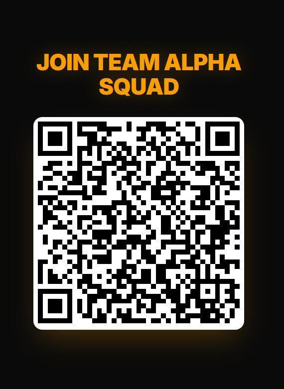
6. **Results**: Celebrate the victors on the live scoreboard.
   <br/>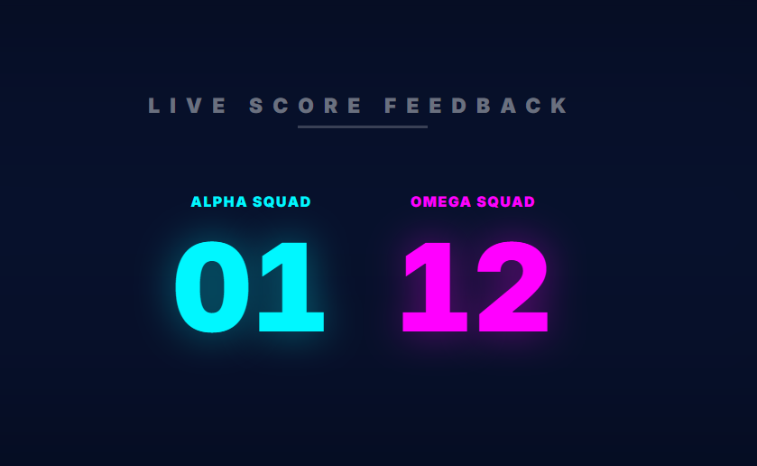

---

## 🚀 Getting Started

### Prerequisites
- **Node.js** 22.x or later.
- **npm** 10.x or later.

### Installation
1. Clone the repository and install dependencies:
   ```bash
   npm install
   ```
2. Configure your environment:
   ```bash
   cp .env.example .env
   # Update credentials in .env
   ```

### Running the Platform
1. Start the development environment:
   ```bash
   npm run dev:server
   npm run dev:client
   ```
2. Access the views:
   - **Management**: `/admin`
   - **Landing Page**: `/`
   - **Game Display**: `/presenter`

---

## 📸 System Overview

### Architecture Context
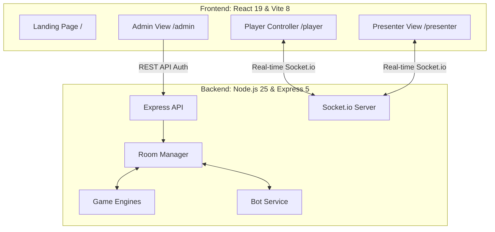

### Collective Input Data Flow
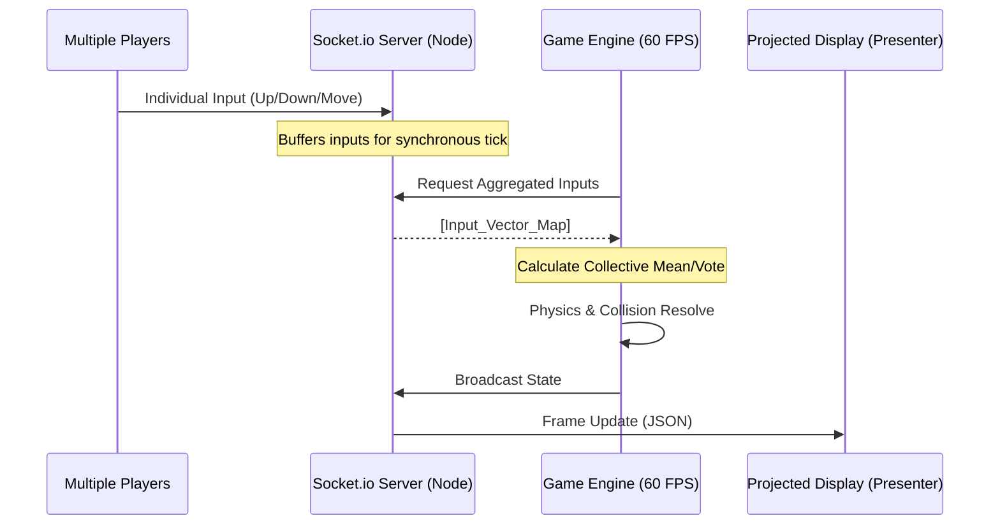

---

## 📜 Licensing & Commercial Use

This project is licensed under the **PolyForm Noncommercial License 1.0.0**.

*   **Personal Use**: Free! You can host a game for your friends or family.
*   **Educational Use**: Free! You can use this to learn or teach.
*   **Commercial Use**: Requires a paid license. If you are a company, an event organizer charging for tickets, or if you intend to rewrite/distribute this code for profit, you must at least [](https://buymeacoffee.com/jovd83) to obtain a commercial license.

---

&copy; 2026 **FlashMob Games**. Maintained by **jovd83**.

